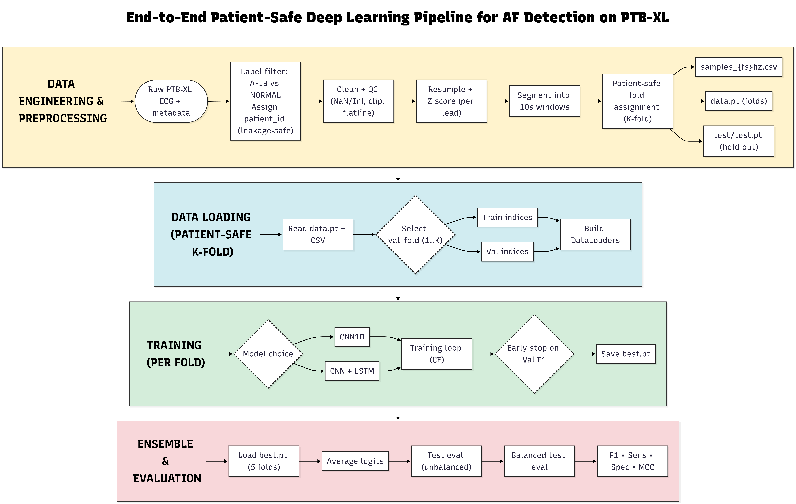

# SEARCH_AF_detection_OsloMet_BachelorGroup

Pipeline for detecting **Atrial Fibrillation (AFIB)** from **PTB-XL ECG** recordings using deep learning (**CNN1D** and **CNN–LSTM**) with **patient-safe splitting**, **K-fold cross-validation**, and **optional hold-out test** evaluation.

---

## What this project does (high level)

1. **Load PTB-XL**
   - Reads ECG signals and metadata
   - Keeps only **AFIB vs NORMAL** subset

2. **Preprocess ECG (universal pipeline)**
   - Cleaning (NaN/Inf fix)
   - Resampling to target sampling rates (62/100/250/500 Hz)
   - Z-score normalization per lead
   - Segmenting into **fixed 10s segments**
   - Optional signal QC: clipping extremes + zeroing flatline leads

3. **Leakage safety (patient-safe splitting)**
   - **Patients are the unit of splitting**
   - No patient appears in multiple folds or splits
   - Segments inherit the fold/split of the parent record/patient
   - If `--folds 10` and PTB-XL official `strat_fold` exists, we use PTB-XL official folds

4. **Training & evaluation**
   - K-fold training (default: **5-fold**)
   - Saves per-fold checkpoints and ROC data
   - Optional **final hold-out test** evaluation using an **ensemble of all folds** (average logits)

---



## Important note on prevalence (class balance)

This project can apply balancing to create an approximately **50/50 AFIB vs NORMAL** dataset (prevalence ≈ 0.5).
That means:

- Training/evaluation results reflect performance on a **balanced** distribution
- Real clinical prevalence may differ, so metrics like accuracy can change under real-world distributions

If you use balanced data, state in the report:

> “All training folds were class-balanced at the segment level (AFIB=NORMAL), therefore evaluation reflects balanced prevalence.”

---`

2. Download the PTB-XL dataset:
   - Visit https://physionet.org/content/ptb-xl/1.0.3/
   - Extract the dataset to your preferred location (default: `/ro/data`)

## Quick Start

Run the interactive pipeline:
```bash
cd src
python main.py
```

The main.py script will guide you through:
1. **PTB-XL Data Location** - Specify where your PTB-XL data is stored
2. **Data Preparation** - Choose to use existing prepared data or create new
3. **Sampling Rate Selection** - Select one or more: 62 Hz, 100 Hz, 250 Hz, 500 Hz
4. **Model Selection** - Choose CNN1D or CNN-LSTM
5. **Training** - Run training with hardware requirements warning

## Project Structure

```
SEARCH_AF_detection_OsloMet_BachelorGroup/
├── src/
│   ├── main.py                    # Interactive pipeline runner
│   ├── train.py                    # Training script for models
│   ├── loader.py                  # Data loading utilities
│   ├── ecg_preprocessing/
│   │   ├── ecg_data_prepare.py   # PTB-XL data loading
│   │   └── ecg_data_preprocessor.py  # Signal preprocessing
│   ├── models/
│   │   ├── cnn1d.py               # 1D CNN model
│   │   └── cnn_lstm.py            # CNN-LSTM model
│   └── checkpoints/               # Saved model checkpoints
│       └── ptb-xl/
│           ├── 62hz/              # Models trained at 62 Hz
│           ├── 100hz/             # Models trained at 100 Hz
│           ├── 250hz/             # Models trained at 250 Hz
│           └── 500hz/             # Models trained at 500 Hz
├── requirements.txt
└── README.md
```

## Data Preparation

To manually prepare the PTB-XL dataset:

```bash
python src/ecg_preprocessing/ecg_data_loader.py \
  --dataset_path /path/to/ptb-xl \
  --name ptb-xl \
  --fs 62 100 250 500 \
  --out_root prepared_data \
  --folds 5 \
  --test_ratio 0.3 \
  --balance_mode global

```

Parameters:
- `--dataset_path`: Path to raw PTB-XL data
- `--name`: Dataset name (ptb-xl)
- `--fs`: Target sampling rates (62, 100, 250, 500 Hz)
- `--out_root`: Output directory for prepared data
- `--test_ratio` 0.3 
- `--folds`: Number of folds for cross-validation (5)

## Training Models

To train a model manually:

```bash
cd src
python train.py --data_path ../prepared_data/ptb-xl/100hz --model cnn1d
```

Parameters:
- `--data_path`: Path to prepared data (e.g., prepared_data/ptb-xl/100hz)
- `--model`: Model type - `cnn1d` or `cnn_lstm`

### Available Sampling Rates
- 62 Hz - Lowest computational cost
- 100 Hz - Balanced option
- 250 Hz - Higher resolution
- 500 Hz - Maximum resolution (original PTB-XL)

### Hardware Requirements
For reasonable training performance:
- **GPU (CUDA-enabled)** - RECOMMENDED
- **OR** At least 12 CPU cores with multithreading

Without adequate hardware, training will be very slow.

## Supported Labels

- **NORMAL** - Normal sinus rhythm
- **AFIB** - Atrial Fibrillation


## Models

### CNN1D
A 1D Convolutional Neural Network for ECG classification.

### CNN-LSTM
A hybrid model combining CNN feature extraction with LSTM for sequence modeling.

## Output

After training, checkpoints are saved to:
```
src/checkpoints/ptb-xl/{sampling_rate}hz/{model_name}/fold_{1-5}/
```

Each fold contains:
- `best.pt` - Best model weights (highest validation F1)
- `last.pt` - Last epoch model weights
- `metrics.txt` - Training metrics
- `roc_val.npz` - ROC curve data

## License

This project is developed for educational purposes.

## References

- PTB-XL Dataset: https://physionet.org/content/ptb-xl/1.0.3/
- Original Paper: Wagner et al. (2020) - PTB-XL, a large publicly available ECG dataset

